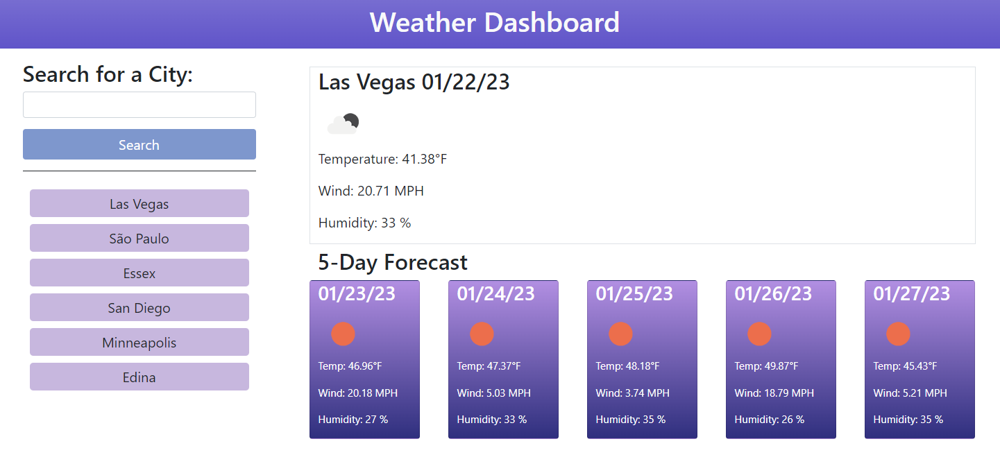

# Weather Dashboard

## Description
Weather Dashboard project is an application that allows users to see the current weather and forecast weather for five future days for the searched city. The information that is shown on the page consists on the date, temperature, wind speed, humidity, and it also shows an icon that represents the weather conditions. This application was created using OpenWeatherMap API, jQuery, Day.js and Bootstrap.\
This project is part of a challenge from Full Stack Coding Bootcamp at the University of Minnesota.

## Installation

N/A

## Usage
To see the weather and forecast for a certain city, the user needs to do the following:
1. On the text box below "Search for a City:", add the name of the city they wish to search.
1. Click on the "Search" button.
1. A search history will be shown under the "Search" button, and users can click on the city's name to see the weather for it again.

## Credits

N/A

## License

Please refer to the LICENSE in the repo.

## Link to live website

https://biajorgensen.github.io/weather-app/

## Website preview

<kbd></kbd>
